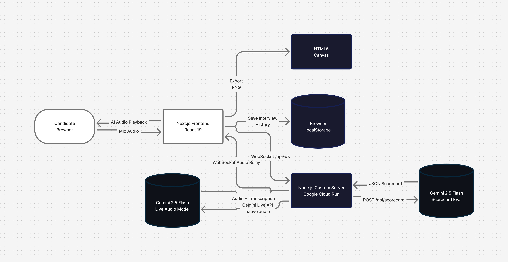

# Crux.ai

**Crux.ai** is a next-generation mock interview platform built for the **Gemini Live Agent Challenge**. It uses the **Gemini 2.5 Flash Native Audio** model to conduct full-duplex, real-time voice interviews — just like a real one.

You speak. The AI listens, asks follow-ups, increases difficulty, and at the end scores your performance across four dimensions.

## Features

- **Live Voice Interviews** — Full-duplex audio via Gemini 2.5 Flash Live API. No typing, no lag.
- **4 Interview Types** — DSA, System Design, Android Developer, HR Interview
- **3 Interviewer Personalities** — Friendly (hints + encouragement), Strict (no hand-holding), FAANG-style (highest bar)
- **Live DSA Problem Card** — For DSA interviews, a Gemini-generated problem appears in real-time as the AI reads it aloud
- **Real-time Transcription** — Character-by-character transcript of both sides of the conversation
- **Automated Scorecard** — Gemini 2.5 Flash evaluates the transcript and scores: Clarity, Confidence, Technical Depth, Conciseness (each /10) + 3–4 coaching suggestions
- **Interview History** — Local history vault of last 50 sessions with scores + PNG export
- **Neural UI** — Animated orb visualizer, dark glassmorphism theme, bento grid layout

---

## Architecture



### How it works

1. User selects interview type + personality on the home page
2. Browser opens a WebSocket to `/api/ws` on the Node.js custom server
3. Server opens a Gemini Live session and relays audio frames bidirectionally
4. For DSA interviews, the server pre-generates a problem and sends it when the AI first speaks
5. On "End Interview", the full transcript is sent to `POST /api/scorecard` → Gemini scores it
6. Results are displayed on the scorecard page and optionally saved to Firestore

**Why a custom server?** Next.js 15 App Router doesn't support WebSocket upgrades natively. A thin Node.js HTTP server wraps Next.js to handle both HTTP and WebSocket at the same port — deployable as a single Docker container on Cloud Run.

---

## Tech Stack

| Layer | Technology |
|---|---|
| Frontend | Next.js 15 (App Router), React 19, TailwindCSS, TypeScript |
| Backend | Node.js 20, Custom HTTP + WebSocket server (`ws`) |
| AI — Live Interview | `@google/genai` → `gemini-2.5-flash-native-audio-preview-12-2025` |
| AI — Scorecard | `@google/genai` → `gemini-2.5-flash` |
| Auth | Firebase Authentication (Google Sign-In) |
| Database | Firebase Firestore |
| Deployment | Docker (multi-stage) → Google Cloud Run |

---

## Local Setup

### Prerequisites

- Node.js 20+
- Gemini API key from [Google AI Studio](https://aistudio.google.com/)
- Firebase project (Auth + Firestore enabled)

### Steps

**1. Clone and install**
```bash
git clone https://github.com/your-username/crux-ai.git
cd crux-ai
npm install
```

**2. Configure environment variables**

Copy the example and fill in your keys:
```bash
cp .env.local.example .env.local
```

```env
# Gemini API (server-side only — never exposed to browser)
GEMINI_API_KEY=your_gemini_api_key_here

# Firebase (client-side — from Firebase Console > Project Settings)
NEXT_PUBLIC_FIREBASE_API_KEY=
NEXT_PUBLIC_FIREBASE_AUTH_DOMAIN=
NEXT_PUBLIC_FIREBASE_PROJECT_ID=
NEXT_PUBLIC_FIREBASE_STORAGE_BUCKET=
NEXT_PUBLIC_FIREBASE_MESSAGING_SENDER_ID=
NEXT_PUBLIC_FIREBASE_APP_ID=
```

**3. Run locally**
```bash
npm run dev
```

Open [http://localhost:3000](http://localhost:3000) — select an interview type and personality, then click **INITIATE_SESSION**.

---

## Docker

Build and run locally with Docker:

```bash
docker build -t crux-ai .
docker run -p 3000:3000 --env-file .env.local crux-ai
```

---

## Google Cloud Run Deployment

### One-time setup

```bash
# Authenticate and set your project
gcloud auth login
gcloud config set project YOUR_PROJECT_ID

# Enable required APIs
gcloud services enable run.googleapis.com artifactregistry.googleapis.com cloudbuild.googleapis.com
```

### Build and deploy

```bash
# Build the container image using Cloud Build
gcloud builds submit --tag gcr.io/YOUR_PROJECT_ID/crux-ai .

# Deploy to Cloud Run
gcloud run deploy crux-ai \
  --image gcr.io/YOUR_PROJECT_ID/crux-ai \
  --platform managed \
  --region us-central1 \
  --allow-unauthenticated \
  --port 3000 \
  --memory 512Mi \
  --set-env-vars "GEMINI_API_KEY=YOUR_GEMINI_KEY,NEXT_PUBLIC_FIREBASE_API_KEY=YOUR_FB_KEY,NEXT_PUBLIC_FIREBASE_AUTH_DOMAIN=YOUR_DOMAIN,NEXT_PUBLIC_FIREBASE_PROJECT_ID=YOUR_PROJECT,NEXT_PUBLIC_FIREBASE_STORAGE_BUCKET=YOUR_BUCKET,NEXT_PUBLIC_FIREBASE_MESSAGING_SENDER_ID=YOUR_SENDER_ID,NEXT_PUBLIC_FIREBASE_APP_ID=YOUR_APP_ID"
```

> **Note:** Cloud Run supports WebSocket connections out of the box. No extra configuration needed.

After deployment, Cloud Run outputs a URL like `https://crux-ai-130670616074.us-central1.run.app`. Add this to Firebase Console under **Authentication > Authorized Domains**.

---

## Hackathon Compliance

| Requirement | Status |
|---|---|
| Category: Live Agents (real-time audio/vision) | ✅ |
| Gemini model usage | ✅ `gemini-2.5-flash-native-audio-preview` + `gemini-2.5-flash` |
| Google GenAI SDK (`@google/genai`) | ✅ |
| Google Cloud service | ✅ Google Cloud Run |
| Public repo + spin-up instructions | ✅ This README |
| Architecture diagram | ✅ Mermaid above + [FigJam](https://www.figma.com/online-whiteboard/create-diagram/f53d8585-5dcd-4ad4-9adc-cfff6e749c90) |
| Demo video < 4 min | ✅ |

---

Built for the [Gemini Live Agent Challenge](https://geminiliveagentchallenge.devpost.com/) — **#GeminiLiveAgentChallenge**